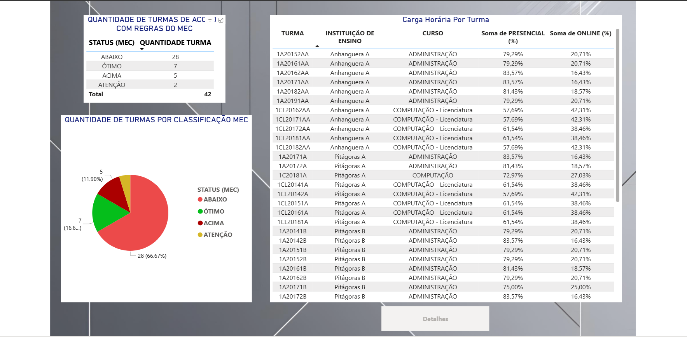
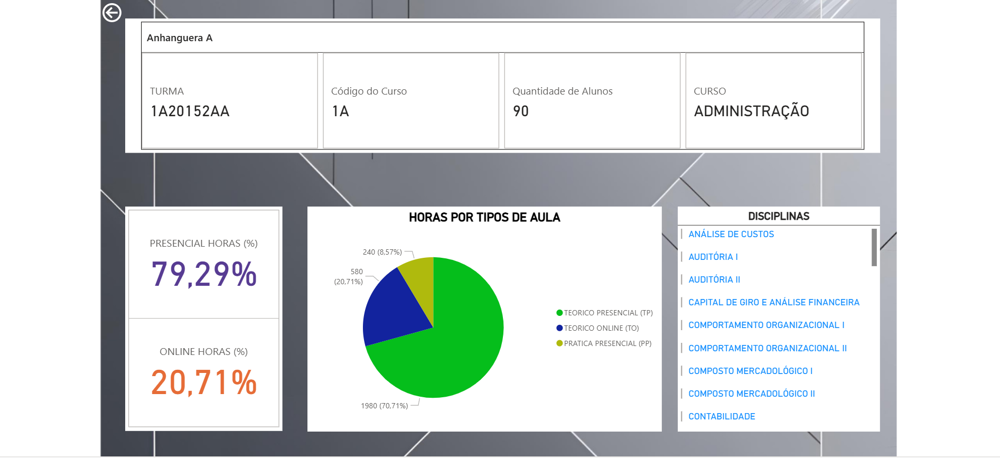

# 📊 Análise de Conformidade de Carga Horária Online – Power BI

Este projeto é um **teste técnico** voltado à análise de dados de diversas instituições de ensino. O objetivo é avaliar se as turmas presenciais estão em conformidade com a regulamentação do MEC sobre o limite de carga horária online.

**Link para o Dashboard:** [Acesse aqui](https://app.powerbi.com/view?r=eyJrIjoiODRhZGNjZTUtODBlMy00ZTc2LTk0NmEtNWQ3ODg5NTE2OTI5IiwidCI6ImNmNzJlMmJkLTdhMmItNDc4My1iZGViLTM5ZDU3YjA3Zjc2ZiIsImMiOjR9&pageName=81d366f4a240b0a67cb6)

## 🔍 Objetivo

Verificar a conformidade das turmas com as regras do MEC:

- **Carga horária online ≤ 40% da carga total**
- **Ótimo**: o mais próximo possível de 40% sem ultrapassar
- **Abaixo**: indica subutilização do permitido
- **Acima**: indica não conformidade

## 📁 Fontes de Dados

As análises são feitas com base nas seguintes abas fornecidas:

- `BaseMatrizes`: Matriz curricular de turmas  
- `BaseCH`: Carga horária por disciplina  
- `BaseAluno`: Número de alunos por turma

---

## 📈 Visão Geral do Dashboard

A tela inicial exibe uma visão geral da conformidade das turmas:

### ▶️ Tela Inicial

- **Tabela** com classificação das turmas:
  - *Bem Abaixo* - abaixo de 30%
  - *Atenção* - acima de 30% e abaixo de 35%
  - *Ótimo* - acima de 35% e abaixo de 40%
  - *Acima* - acima de 40%
- **Gráfico de pizza** com a distribuição das classificações
- **Tabela detalhada** com carga horária presencial e online de cada turma

### 🖱️ Interação

- Ao **clicar em uma turma** e no botão correspondente:
Abre uma tela com **informações específicas** da turma selecionada:

---

## 📝 Resultado das Análises

**1. Quantidade de turmas fora da regra do MEC (acima de 40%):**  
✅ **5 turmas**

**2. Turmas não conformes:**

- `1CL20142A`  
- `1CL20162AA`  
- `1CL20171AA`  
- `1CL20181C`  
- `1CL20182AA`

**3. Classificação das turmas:**

| Classificação        | Quantidade | Representatividade |
|----------------------|------------|---------------------|
| Bem Abaixo (< 30%)   | 28         | 66,67%              |
| Atenção (30% - 35%)  | 2          | 4,76%               |
| Ótimo (35% - <40%)   | 7          | 16,67%              |
| Acima (> 40%)        | 5          | 11,90%              |

---

## 🧠 Considerações Técnicas

- A análise considera disciplinas com nomes iguais, mas com tipos e cargas diferentes.
- A carga horária é consolidada por turma com base no tipo de disciplina.
- Foram mantidas **fórmulas no Excel** para análise do raciocínio.
- O painel é 100% interativo e foi desenvolvido no **Power BI**.

---

## ✅ Conclusão

Este projeto demonstra a capacidade de:

- Integrar dados a partir de um relacionamento
- Criar análises e visualizações claras e interativas  
- Atender requisitos técnicos com foco em regras educacionais
